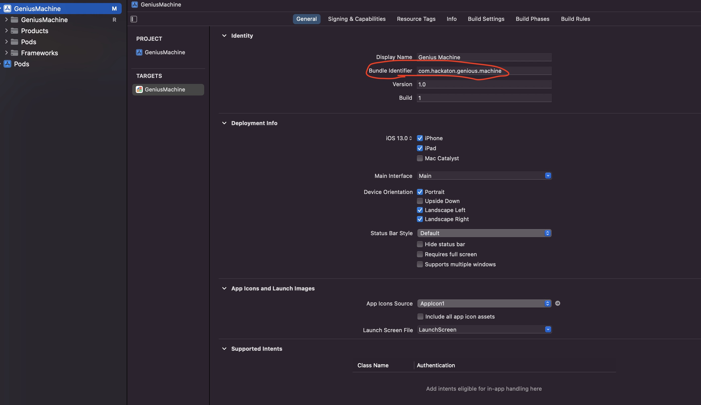
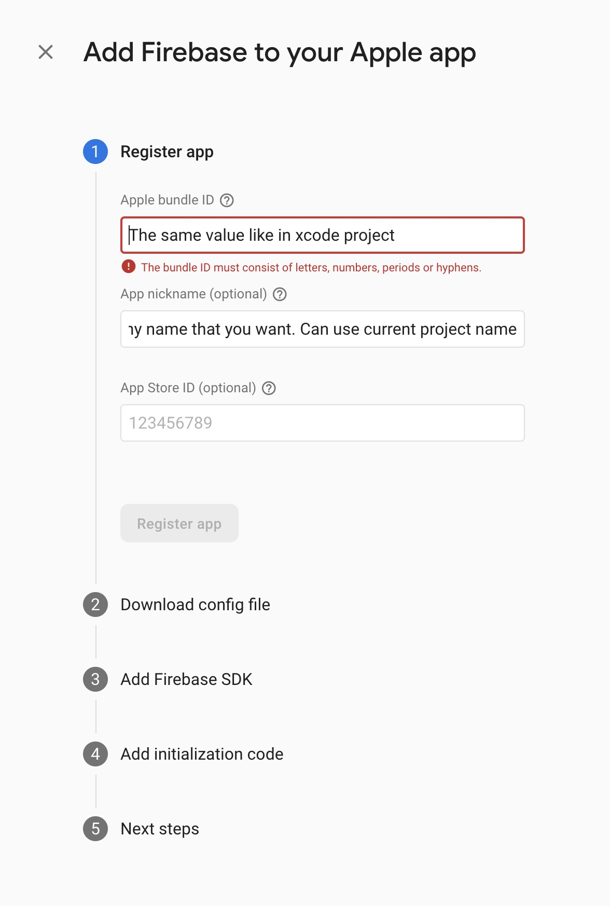
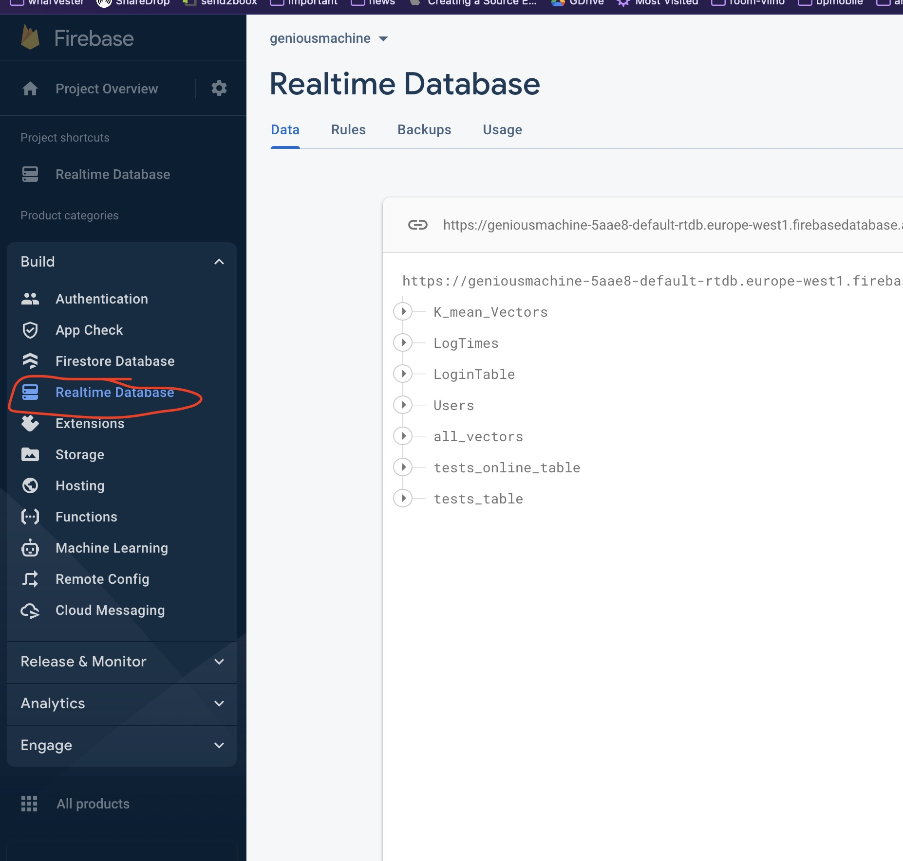
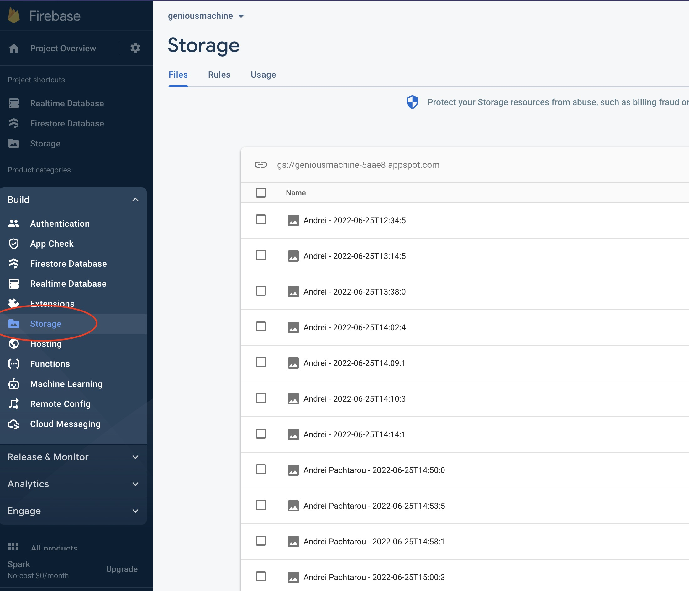
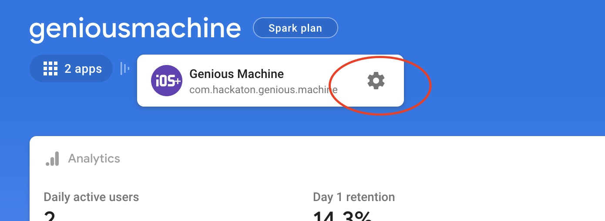
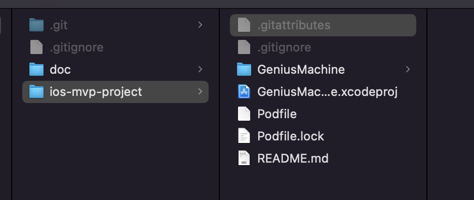

# Requiments

- MacOS
- Xcode
- apple developer account is preferable
- iOs device with camera
- Configured Firebase account (used to store faceID's remotly)
- installed [Cocoapods](https://cocoapods.org/) opensource tool for iOs development

**P.S.**
I'm not sure is it a possible to run project without Apple developer account.

# Steps

## 1. Firebase configuration

App should have configured free Firebase account (gmail account required).

After registration you should add iOs project in [console.firebase.google.com](https://console.firebase.google.com/u/0/)

### Follow next steps

1. Change application bundle identifier in Xcode to any yours

2. Choose you current Firebase project

3. Fill new Firebase iOs app profile

Use the same **application bundle identifier** like in **1**st step.

You can download configuration file here, but it not redy to use. We should complete registration on this screen, steps after 2 is optional

4. Turn on Firebase services

On screens below configure marked services

5. Download GoogleService-Info.plist

Copy it to project

6. Install dependencies

Install [Cocoapods](https://cocoapods.org/

In root of source codes run command: `pod instal`

7. OPen project and run App

In Finder boupbe tap on GeniusMachine.xcworkspace
Choose active devise and press CMD+R