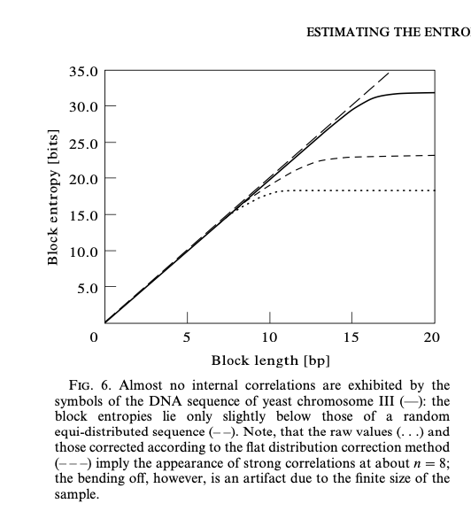

# Open questions

**99% of the DNA is common among humans. How do you place your markers to pick out the individually-varying locations?**

Andrei: It's possible to identify loci varying between individuals and read there.

**how many bits are there of actual randomness of the 100 sequential (!!) bases (max: 200 bits but likely much less)**

- scientific literature shows that up to e.g. length 20 the entropy close to maximal in yeast chromosome III

**Some bases could still be common in the 100-base set and sequential rules could reduce entropy.**

- DNA and sickness (leukemia can cause deletion of chromosomes) ?

**How to work with leaked DNA vs. key material?**

If the DNA of anyone leaks and is used in a timely fashion to re-construct key generation material it's compromised forever.

**Identical twins?**

If DNA is used to access, can have separate key material (and each can access others data unless protected by another layer).

**Selling DNA data is going against access control**

If DNA data is being processed and sold (even with restricted access), it increases risk of DNA material getting out.

**using RNA could help us prevent replay attacks**

RNA degrades faster

**can likely use different sources of genetic data to help establish variability**

- some data are sourced from DNA and should be stable in time
- other data are sourced from e.g. nose or other bodily regions, these change over time but keep a distinct profile
- we can check DNA for "equality" and the meta-genomic data for "profile match"
- some of the data decays quickly
